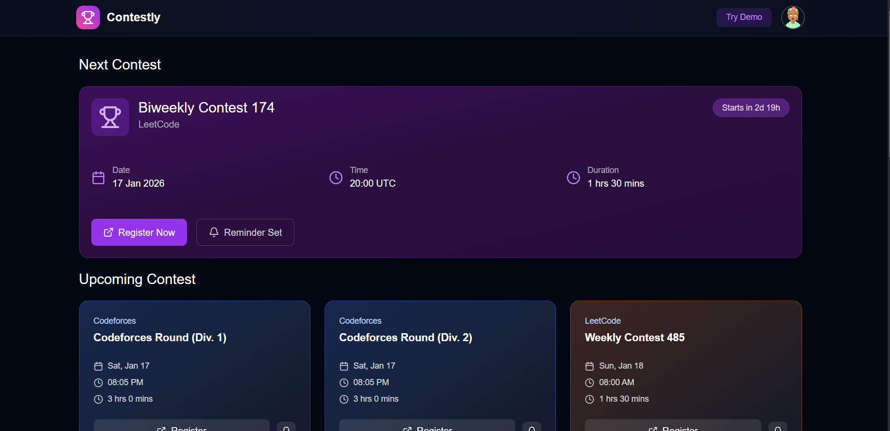
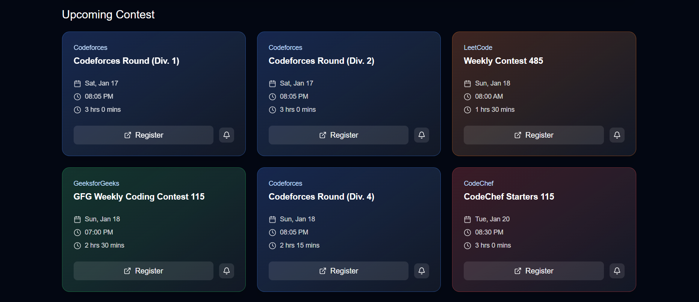
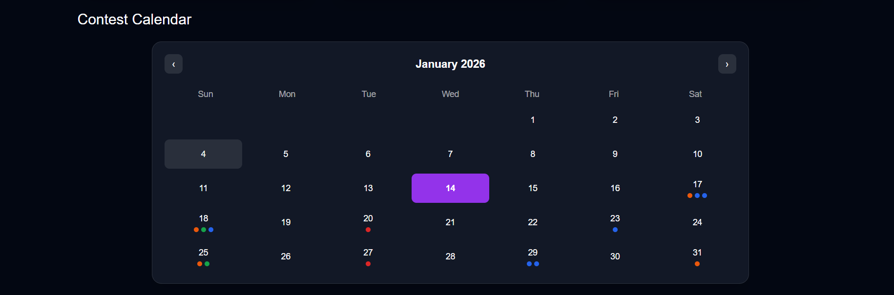
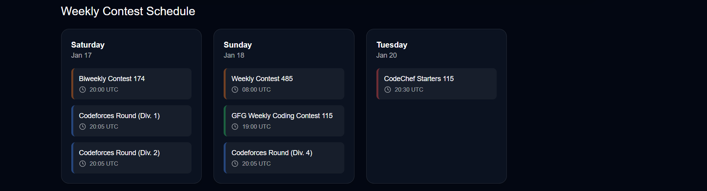

# 🚀 Contest Tracker & Competitive Programming Analytics Platform

A full-stack web application that helps competitive programmers track, analyze, and visualize their performance across multiple platforms like **Codeforces** and **LeetCode** — all in one place.

Built with **MERN Stack**, modern UI, real-time analytics, and a **Demo Mode** for easy showcasing without login.

---

## ✨ Features

### 🔗 Connected Accounts

* Connect **Codeforces** and **LeetCode** accounts
* Username validation before saving
* Secure storage in backend

### 📊 Analytics Dashboard

* **Total Contests Participated**
* **Average Rating (Cross-platform)**
* **Problems Solved Breakdown (Easy / Medium / Hard)**
* **Badges Earned**
* **Win Rate**
* **Average Rank Change**
* **Best Performance (Percentile)**
* **Platform-wise Comparison Table**

### 📈 Visual Charts

* **Rating Progress Line Chart** (last 6 months)
* **Problems Solved Distribution**
* **Platform Comparison Graphs**

### 👤 Profile & Settings

* Change password
* Update linked accounts
* Notification preferences (UI)
* Personal profile overview

### 🎭 Demo Mode (No Login Required)

* Fully working UI with **hardcoded realistic data**
* Perfect for:

  * Project demo
  * Recruiter presentation
  * Offline showcase
* No backend or API calls in demo mode

---

## 🛠 Tech Stack

### Frontend

* **React.js**
* **Tailwind CSS**
* **Recharts** (Charts & Graphs)
* **Axios**
* **Lucide Icons**

### Backend

* **Node.js**
* **Express.js**
* **MongoDB**
* **Mongoose**
* **JWT Authentication**
* **bcrypt**

### APIs Used

* **Codeforces Official API**
* **LeetCode Unofficial API (alfa-leetcode-api)**

---

## 🏗 Project Structure

```
contest-tracker/
├── backend/
│   ├── controllers/
│   ├── models/
│   ├── routes/
│   └── utils/
│
├── frontend/
│   ├── src/
│   │   ├── components/
│   │   ├── pages/
│   │   ├── demo/
│   │   ├── config/
│   │   └── utils/
│
└── README.md
```

---

## ⚙️ Setup Instructions

### 1️⃣ Clone the Repository

```bash
git clone https://github.com/your-username/contest-tracker.git
cd contest-tracker
```

---

### 2️⃣ Backend Setup

```bash
cd backend
npm install
```

Create `.env` file:

```env
PORT=5000
MONGO_URI=your_mongodb_connection_string
ACCESS_TOKEN_SECRET=your_access_token_secret
REFRESH_TOKEN_SECRET=your_refresh_token_secret
```

Run backend:

```bash
npm run dev
```

---

### 3️⃣ Frontend Setup

```bash
cd frontend
npm install
npm run dev
```

---

## 🎭 Demo Mode Usage

This project includes a **Demo Mode** for showcasing without login or backend.

To enable:

```js
// src/config/demoMode.js
export const DEMO_MODE = true;
```

To disable (real backend mode):

```js
export const DEMO_MODE = false;
```

In demo mode:

* All profile data is loaded from `demoUser.js`
* Charts use mock data
* API calls are skipped
* Actions like connect/update are disabled

---

## 📸 Screenshots






```
- Profile Overview
- Connected Accounts
- Analytics Dashboard
- Rating Progress Chart
- Platform Comparison Table
```

---

## 🧠 Architecture Highlights

* **Single source of truth** for user data
* **Platform-agnostic analytics logic**
* **Modular controllers** for each metric
* **Scalable design** for adding more platforms (CodeChef, GFG)
* **Demo Mode toggle** without code duplication

---

## 🔐 Security

* JWT-based authentication
* Password hashing using bcrypt
* Protected routes using middleware
* Platform username validation before storing

---

## 🚧 Future Enhancements

* Add CodeChef & GeeksforGeeks integration
* OAuth login with platforms
* Weekly performance reports
* Email notifications
* Leaderboard & global comparison
* Public shareable profile links

---

## 👨‍💻 Author

**Sahil Raut**
Final Year Computer Engineering Student
Aspiring Full Stack Developer

---

## ⭐ If you like this project

Give it a ⭐ on GitHub — it helps a lot!
